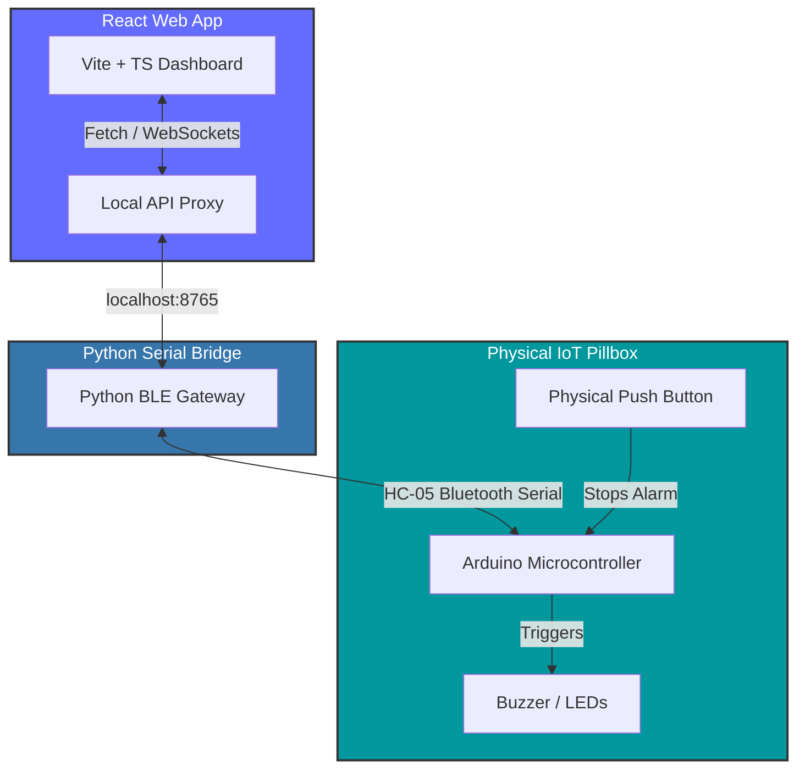

# 💊 Smart Medicine Reminder System (Gentle Dose)

[](https://vitejs.dev/)
[](https://reactjs.org/)
[](https://www.typescriptlang.org/)
[](https://www.python.org/)
[](https://www.arduino.cc/)
[](https://github.com/navneethvaradharaj11-dev/smart-medicine-reminder-system/actions)

An intelligent, cross-platform healthcare assistant designed to improve medication adherence. **Gentle Dose** pairs a state-of-the-art React web application with a physical IoT Smart Pillbox via a Python-based Bluetooth gateway. It features rich visual dashboard metrics, adherence analytics, a virtual pillbox, and fully integrated English and Tamil voice assistant support to facilitate usage by the elderly and visually impaired.

---

## 🌟 Key Features

*   **📊 Adherence Analytics & Dashboard**: Displays patient adherence scores, upcoming doses, and a virtual representation of the physical pillbox layout.
*   **🔊 Bi-lingual Voice Assistance**: Fully integrated audio assistant supporting English and Tamil voice commands, talkback, and auditory reminders to enhance accessibility.
*   **🔗 IoT Bluetooth Integration**: Seamless Windows Bluetooth pairing and communication with the physical smart pillbox.
*   **📁 Dose History Log**: Complete adherence records tracking taken/skipped doses in an interactive calendar and list layout.
*   **👤 Patient & Caretaker Profiles**: Configurable doctor details, emergency contacts, medicine lists, and caretakers.
*   **🤖 Hardware Diagnostics**: Diagnostic tools for testing buttons, buzzer indicators, and BLE serial connectivity.

---

## 🏗 System Architecture

The project consists of three tightly coupled components:

1.  **Vite + React UI**: The modern frontend dashboard that schedules medicines, displays analytics, and controls reminder statuses.
2.  **Python BLE Serial Gateway**: A local background server that acts as a bridge, utilizing Python's native serial/socket capabilities to communicate with the hardware pillbox and expose APIs to the frontend.
3.  **Arduino Smart Pillbox**: The physical IoT device equipped with LED indicator rings, an alarm buzzer, and a confirmation button.



---

## ⚙️ Component Details

### 1. Web Application (`src/`)
-   **State Management & Routing**: React Router DOM & Tailwind animations.
-   **UI Library**: Shadcn UI & Radix UI primitives.
-   **Localization**: English & Tamil localizations with dynamic voice synthesize APIs.

### 2. Python Bluetooth Gateway (`gentle_dose.py`)
-   Exposes a native Bluetooth API on `http://127.0.0.1:8765`.
-   Handles automatic serial connection with the HC-05 Bluetooth transceiver.
-   Routes real-time hardware state updates to the React app.

### 3. Arduino Firmware (`arduino/smart_medicine_reminder/`)
-   Synchronizes system time automatically from the Python gateway via `TIME:HH:MM:SS` commands.
-   Sounds high-pitch alarms (`ALARM:START`) when a dose is due.
-   Monitors the confirmation button to dispatch `BTN:PRESSED` signals, shutting off alarms and updating adherence logs.

---

## 🛠️ Installation & Setup

### Prerequisites
-   [Node.js](https://nodejs.org/) (v18 or higher)
-   [Python 3.10+](https://www.python.org/downloads/)
-   [Arduino IDE](https://www.arduino.cc/en/software) (for uploading firmware)

### 1. Setting up the Web App

Navigate to the project root directory and install dependencies:

```powershell
# Navigate to project directory
cd gentle-dose-main

# Install frontend dependencies
npm install
```

To run the standalone web application locally:

```powershell
npm run dev -- --host 127.0.0.1
```
Open [http://127.0.0.1:5173](http://127.0.0.1:5173) in your browser.

---

### 2. Running with Physical Hardware (Python Bridge)

If you are using the physical IoT Pillbox, build the production frontend assets and launch the Python native gateway:

```powershell
# Build Vite production assets
npm run build

# Start the Python BLE serial server
python gentle_dose.py
```

For custom serial connection parameters (e.g. connecting to a specific HC-05 address):

```powershell
python hardware_reminder_controller.py --address 00:25:12:00:23:35 --reminder 19:15
```

---

### 3. Uploading Arduino Firmware

1.  Connect your Arduino (Nano/ESP32/Uno) to your computer.
2.  Open `arduino/smart_medicine_reminder/smart_medicine_reminder.ino` in the Arduino IDE.
3.  Configure your pin layout in the sketch:
    -   `BT_RX` & `BT_TX` for Bluetooth Serial (default Pins 2 & 3).
    -   `BUZZER_PIN` (default Pin 8).
    -   `BUTTON_PIN` (default Pin 7).
4.  Select your board and COM port, then click **Upload**.

---

## 🧪 Testing

The codebase includes full React testing utilities powered by **Vitest**:

```powershell
# Run the test suite once
npm run test

# Run tests in watch mode
npm run test:watch
```

---

## 🚀 GitHub Actions CI/CD Workflow

A professional CI/CD pipeline is configured in `.github/workflows/ci.yml` that automatically:
1.  Triggers on every `push` and `pull_request` to the `main` branch.
2.  Sets up Node.js.
3.  Installs dependencies, runs the ESLint checker (`npm run lint`), runs automated tests (`npm run test`), and verifies the production build (`npm run build`).

---

## 🔐 Deploying to GitHub (Google-Linked Accounts)

Because your GitHub account is linked to your Google Account, follow these simple steps to authenticate and push this project:

### Option A: Authenticaton via Git Credential Manager (Easiest)
1. Initialize the local repository and commit files (see below).
2. Push your project to GitHub. A Windows popup will appear.
3. Select **"Sign in with your browser"** and choose your Google/GitHub account.

### Option B: Authentication via GitHub CLI
Install GitHub CLI on your Windows machine and authenticate:
```powershell
# Login with GitHub CLI
gh auth login
```
*Choose `GitHub.com` -> `HTTPS` -> `Yes` (to authenticate Git) -> `Login with a web browser`. Copy the code provided, paste it into the browser window, and log in with your Google-tied GitHub credentials.*

### Commands to Push Your Project:
Create a new public repository named `smart-medicine-reminder-system` on GitHub, then run:

```powershell
# Initialize git in the project root
git init

# Set the default branch to main
git branch -M main

# Add all files to stage (excluding those in .gitignore)
git add .

# Create the initial commit
git commit -m "feat: Initial commit of Smart Medicine Reminder System (Gentle Dose)"

# Link your local repository to GitHub
git remote add origin https://github.com/navneethvaradharaj11-dev/smart-medicine-reminder-system.git

# Push your code to the remote repository
git push -u origin main
```

---

## 📄 License

This project is licensed under the MIT License - see the LICENSE file for details.
